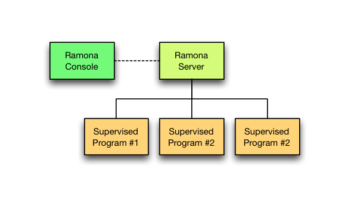
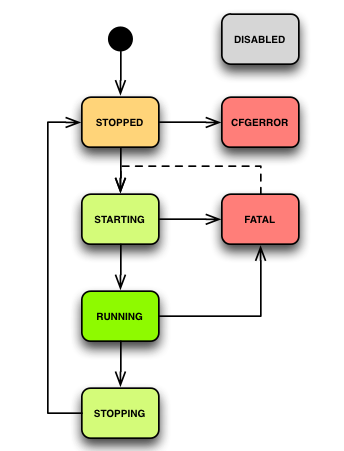

Features
========

Program and program roaster
---------------------------

Ramona maintains pre-configured set of programs; these programs are placed in a 'roaster', list that is managed by Ramona server.
Each program in this roaster has a status that reflects its current phase of life cycle. Ramona is responsible for supervising of these programs in terms of their uptime, eventual restarts, logging etc.

List of program statuses
^^^^^^^^^^^^^^^^^^^^^^^^
  * DISABLED - program is disabled by configuration; Ramona will not launch this program at any condition.
  * STOPPED - program is stopped (not running); you can launch it by 'start' command.
  * STARTING - program has been just launched.
  * RUNNING - program is running for some time already.
  * STOPPING - program has been asked to terminate but it has not exited yet.
  * FATAL - program exited in a errorneous way (maybe several times in row) and Ramona evaluated this as non-recoverable error.
  * CFGERROR - program is incorrectly configured and cannot be launched.

Command-line console
--------------------

Ramona provides command-line console, a tool that allows interaction with Ramona server and thru this controlling of all application programs. This tool can be tighly integrated with application that uses Ramona and it is designed to represent 'single point of execution' of given application.

This approach simplifies maintenance of the application and allow easy operating of even complex applications consisting of many different programs.

User can also add their custom commands (see `custom tools`_) to cover all needs of its application.

.. _features-logging:

Logging and log scanning
------------------------

Ramona monitors `standard output`_ and `standard error`_ streams of all its supervisored programs. These streams are persisted to files on a filesystem in a highly configurable way. It is a primary way of how Ramona approaches logging so programs are advised to log using standard streams instead on logging into log files. It also enables Ramona to capture any other textual output of the program that may not be captured by typical logging mechanism like unexpected kills or top-level exceptions.

.. _`standard output`: http://en.wikipedia.org/wiki/Standard_streams
.. _`standard error`: http://en.wikipedia.org/wiki/Standard_streams

Ramona also allows to configure scanner that seeks thru log streams for given patterns and if such a pattern is found, then Ramona notifies about such an event via email.

Custom tools
------------

Ramona can be easily extended by custom commands; these are implemented in Python and enables cross-platform automation of common tasks connected with the application.

Example of tool function:

.. code-block:: python

  class FooConsoleApp(ramona.console_app):

  	@ramona.tool
  	def mytool(self):
  		'''This is help text of my tool'''
  		...

Example of tool class:

.. code-block:: python

  class FooConsoleApp(ramona.console_app):

  	@ramona.tool
  	class mytool(object):
  		'''This is help text of my tool'''
  	
  		def init_parser(self, cnsapp, parser):
			parser.description = '...'
			parser.add_argument(...)
  
		def main(self, cnsapp, args):
  			...

.. note::
  This manual is actually build using this feature, by executing ``./ramona.py manual``.

Environment variables
---------------------

Ramona sets following environment variables to propagate certain information to programs, that are launched as Ramona subprocesses.
This allows exchange of configuration information in a control way, helping to keep overall configuration nice and tidy.

.. attribute:: RAMONA_CONFIG

  This environment variable specifies list of configuration files that has been used to configure Ramona server.
  List is ordered (configuration values can overlap so correct override behaviour needs to be maintained) and its separator is ':' for POSIX or ';' for Windows. See ``os.pathsep`` in Python.

  Client application can use this variable to read configuration from same place(s) as Ramona did.

.. attribute:: RAMONA_CONFIG_WINC

  Content and format is the same as in :attr:`RAMONA_CONFIG` however this one contains also expanded includes (see ``[general]`` :attr:`include` configuration option). The order of loading is kept correctly.

.. attribute:: RAMONA_SECTION

  This environment variable reflect name of section in Ramona configuration files that in relevant for actual program (subprocess of Ramona). Uses can use this value to reach program specific configuration options.

Example:

  .. code-block:: ini

    [program:envdump]
    command=bash -c "echo RAMONA_CONFIG: ${RAMONA_CONFIG}; echo RAMONA_SECTION: ${RAMONA_SECTION}"

This produces following output:

  .. code-block:: console

    RAMONA_CONFIG: ./test.conf
    RAMONA_SECTION: program:envdump

.. note::

  Configuration files are compatible with Python Standart Library ``ConfigParser`` module.
  You can read configuration files using this module in order given by ``RAMONA_CONFIG`` environment variable and access configuration values. You can use ``RAMONA_SECTION`` environment variable to identify section in configuration files that is relevant to your actual program.

Web console
-----------

.. image:: img/httpfend.png
   :width: 600px

Displays states of supervised programs using web browser. It also allows user to start/stop/restart each or all of them or retrieve recent standart output and/or standard error of each program.

.. _`features-windowsservice`:

Windows service
---------------

Ramona is using `Windows Services`_ for background execution on Windows platform.
It also depends on ``pythonservice.exe`` tool from `Python for Windows extensions`_ package. Therefore it is possible to install Ramona equipped application as Windows service via commands that are provided by Ramona system. This can be used for automatic start-up after system (re)boot or to enable smooth development on Windows machine.

You can have multiple Ramona Windows services installed on a box; for example for different Ramona-equipped applications or versions.

For more details continue to:

- :ref:`cmdline-wininstall`
- :ref:`cmdline-winuninstall`

.. _`Windows services`: http://en.wikipedia.org/wiki/Windows_service
.. _`Python for Windows extensions`: http://sourceforge.net/projects/pywin32/
